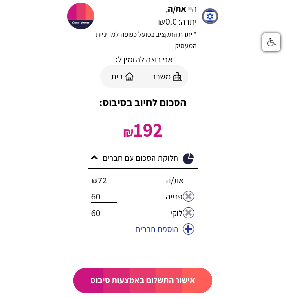

# Clipboard to Cibus

Tired of manually filling the Cibus payments form at the end of a Wolt order?  
_Clipboard to Cibus_ is a userscript which fills it for you, using Bolt's output as the source of information.

> [!CAUTION]
> Using this userscript may incur unexpected charges. Use at your own risk.

## Installation

0. Install a userscripts browser extension such as [Tampermonkey](https://www.tampermonkey.net/).
1. Install _Clipboard to Cibus_ by clicking [here](https://github.com/ramikg/clipboard-to-cibus/raw/main/clipboard-to-cibus.user.js).

## Usage

| Bolt output (`Ctrl-C`)                    | Before `Ctrl-V`                              | After `Ctrl-V`                             |
|-------------------------------------------|----------------------------------------------|--------------------------------------------|
|  |  |  |

If the names don't match up, the userscript will ask you for assistance and remember your answer.
